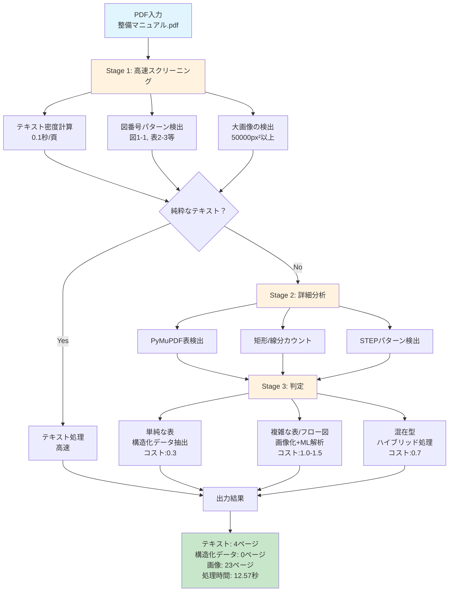
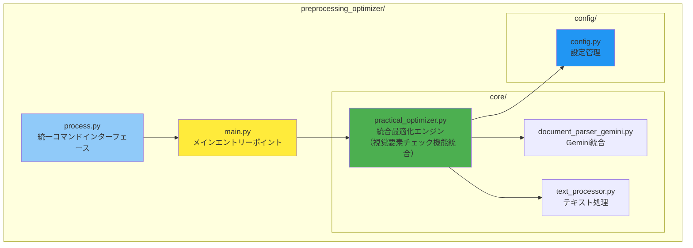
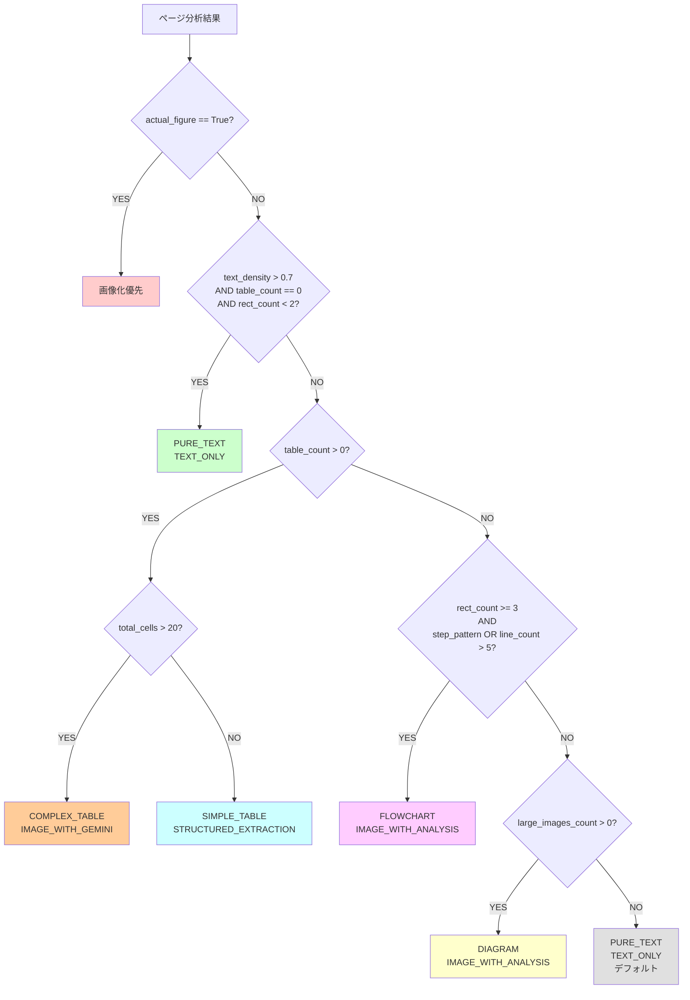
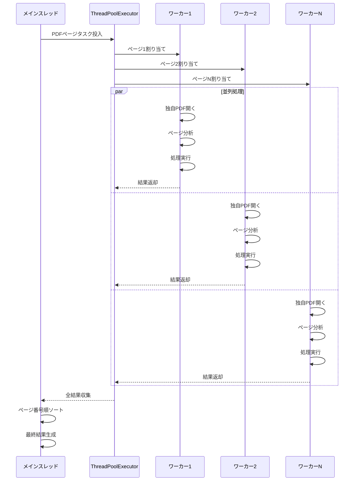

# Preprocessing Optimizer 技術ドキュメント

## 1. システム概要

### 1.1 目的
日本語技術文書に特化したPDF前処理システム。図表を含むページを自動検出し、選択的に画像化することで、RAGシステムの精度向上とコスト最適化を実現。

### 1.2 主要コンポーネント
- **PracticalPageAnalyzer**: 統合ページ分析エンジン（視覚要素チェック機能統合済み）
- **PracticalDocumentProcessor**: ドキュメント処理エンジン
- **PracticalConfig**: 設定管理

## 2. アーキテクチャ

### 2.1 システム構成図



### 2.2 モジュール構成



## 3. コア処理ロジック

### 3.1 段階的ページ分析アルゴリズム

#### 段階1: 高速スクリーニング（`_quick_screening`）

**処理フロー:**
1. **スキップパターンチェック**
   - 目次、索引、はじめに、奥付などを検出
   - 最初の200文字をチェックして早期判定

2. **テキスト密度計算**
   ```python
   text_density = text_area / page_area
   ```
   - 閾値: 0.8以上 → 純粋なテキストページの可能性大

3. **図番号検出ロジック**
   ```
   図番号パターン:
   - 図\d+[-\.]\d+ (例: 図1-1, 図2.3)
   - 表\d+[-\.]\d+ (例: 表1-1)
   - Fig.\d+[-\.]\d+ (例: Fig.1-1)
   
   参照パターン（実際の図ではない）:
   - 図\d+を参照
   - 図\d+に示す
   - 前述の図\d+
   - については図\d+
   等、15種類のパターン
   ```

4. **実際の図判定アルゴリズム**
   ```python
   if has_figure_number and not has_figure_reference:
       # 3つのパターンで実際の図かチェック
       1. 行頭に図番号（^|\n)\s*図\d+[\s　:]
       2. 独立した行に図番号（^|\n)\s*図\d+\s*(\n|$)
       3. 中央揃えの図番号（^|\n)\s{3,}図\d+(\s|$)
   ```

#### 段階2: 詳細分析（`_detailed_analysis`）

**処理内容:**
1. **PyMuPDF表検出**
   ```python
   tables = page.find_tables()
   for table in tables:
       cell_count = len(table.cells)
   ```

2. **図形要素分析**
   ```python
   drawings = page.get_drawings()
   # 矩形(rect)、線(line)、曲線(curve)をカウント
   ```

3. **視覚要素の存在確認（統合機能）**
   ```python
   has_visual_element = (
       rect_count > 0 or 
       line_count > 0 or 
       len(tables) > 0
   )
   # 埋め込み画像の確認
   for img in page.get_images():
       if width > 100 and height > 100:
           has_visual_element = True
   ```

4. **テキストパターン分析**
   - ステップパターン: `(STEP|ステップ|手順)\s*[0-9０-９①-⑩]`
   - 番号リスト: `[①-⑩]|[1-9]\.\s`

#### 段階3: 処理方法決定（`_determine_processing`）

**視覚要素チェック統合:**
視覚要素がない場合は、図番号キーワードが存在しても参照文として扱い、テキスト処理を行います。これにより誤検知を防止し、処理精度を向上させています。

**信頼度（Confidence）の計算方法:**

信頼度は0〜100のスコアで、各検出要素に基づいて累積的に計算されます：

| 検出要素 | 追加スコア | 説明 |
|---------|-----------|------|
| **表検出** | +30 | PyMuPDFのfind_tables()で表を検出 |
| **フローチャート** | +60〜80 | 矩形と矢印の組み合わせを検出<br>基本60 + flowchart_confidence_boost(20) |
| **一般図形** | +40 | 矩形、線、曲線の組み合わせ（閾値以上） |
| **複合図形** | +35 | 総要素数が閾値を超える場合 |
| **図番号キーワード** | +20 | 図番号パターンと視覚要素の両方がある場合 |
| **埋め込み画像** | +50 | 最小サイズ以上の画像を検出 |
| **複雑なレイアウト** | +10 | テキストブロックの位置分散が大きい |

**信頼度の正規化:**
- 最終スコアは100を上限として正規化
- `result['confidence'] = min(result['confidence'], 100)`

**処理方法決定時の信頼度:**

| ページタイプ | 処理方法 | 信頼度 |
|-------------|---------|--------|
| 純粋なテキスト | TEXT_ONLY | 0.9 |
| 単純な表 | STRUCTURED_EXTRACTION | 0.8 |
| 複雑な表 | IMAGE_WITH_GEMINI | 0.85 |
| フローチャート | IMAGE_WITH_ANALYSIS | 0.75〜0.8 |
| 図・ダイアグラム | IMAGE_WITH_ANALYSIS | 0.75〜0.8 |
| 混在型 | HYBRID | 0.6 |
| デフォルト | TEXT_ONLY | 0.5 |

**判定ロジックツリー:**



### 3.2 並列処理アーキテクチャ

**実装方式:**
```python
ThreadPoolExecutor(max_workers=min(cpu_count(), 8))
```

**並列処理フロー:**



**並列化戦略:**
1. 各ページを独立したタスクとして処理
2. スレッドごとに独立したPyMuPDFドキュメントオブジェクトを作成
3. 結果は非同期で収集し、最後にページ番号順でソート

### 3.3 メモリ管理戦略

1. **Pixmapオブジェクト管理**
   ```python
   pix = page.get_pixmap(matrix=mat)
   try:
       # 処理
   finally:
       pix = None  # 明示的な解放
   ```

2. **PIL Image管理**
   ```python
   with Image.open(io.BytesIO(img_data)) as img:
       # コンテキストマネージャで自動解放
   ```

## 4. アルゴリズム詳細（擬似コード）

### メインアルゴリズム
```pseudo
ALGORITHM ProcessPDF(pdf_path, output_dir, use_parallel)
    START_TIME ← current_time()
    doc ← open_pdf(pdf_path)
    results ← initialize_results_structure()
    
    IF use_parallel THEN
        results ← process_parallel(doc, output_dir)
    ELSE
        results ← process_sequential(doc, output_dir)
    END IF
    
    results.processing_time ← current_time() - START_TIME
    save_json(results, output_dir)
    RETURN results
END ALGORITHM
```

### 図番号検出アルゴリズム
```pseudo
ALGORITHM DetermineActualFigure(text, has_figure_number, has_reference)
    IF NOT has_figure_number THEN
        RETURN false
    END IF
    
    IF has_reference THEN
        RETURN false
    END IF
    
    // 実際の図番号パターンチェック
    figure_patterns ← [
        r'(?:^|\n)\s*図\d+[\s　:]',      // 行頭の図番号
        r'(?:^|\n)\s*図\d+\s*(?:\n|$)',  // 独立行の図番号
        r'(?:^|\n)\s{3,}図\d+(?:\s|$)'   // 中央揃えの図番号
    ]
    
    FOR pattern IN figure_patterns DO
        IF regex_match(pattern, text) THEN
            RETURN true
        END IF
    END FOR
    
    RETURN false
END ALGORITHM
```

## 5. 設定パラメータ

### 5.1 重要な閾値
| パラメータ | デフォルト値 | 影響 |
|----------|------------|-----|
| quick_text_density_threshold | 0.8 | 高い値→より多くのページをテキストと判定 |
| min_table_cells | 6 | 低い値→より多くの構造を表と認識 |
| complex_table_cell_threshold | 20 | 高い値→複雑な表の判定基準が厳しくなる |
| high_confidence_threshold | 0.8 | 判定の信頼度基準 |

### 5.2 画像化設定
- **image_dpi_multiplier**: 画像品質とファイルサイズのトレードオフ
  - 1.0: 低品質・小サイズ
  - 2.0: 標準品質（デフォルト）
  - 3.0以上: 高品質・大サイズ

## 6. パフォーマンス特性

### 6.1 処理時間
| 処理タイプ | 1ページあたり時間 | メモリ使用量 | 出力サイズ |
|-----------|-----------------|------------|-----------|
| テキスト処理 | 0.1秒 | 低（1MB） | 小（1-10KB） |
| 構造化抽出 | 0.3秒 | 中（5MB） | 中（10-50KB） |
| 画像化（200DPI） | 0.5秒 | 高（20MB） | 大（100KB-1MB） |

### 6.2 並列処理効果
- 大規模PDFでは最大で処理時間を50-70%短縮
- CPUコア数に基づく自動スレッド数調整（最大8スレッド）

## 7. エラーハンドリング

### 7.1 エラーレベル
1. **ページレベルエラー**: 個別ページの処理失敗
   - 該当ページをスキップし、処理を継続
   
2. **ドキュメントレベルエラー**: PDF全体の処理失敗
   - 部分的な結果でも返却
   
3. **システムレベルエラー**: 致命的エラー
   - 適切なエラーメッセージ表示

### 7.2 リカバリー機構
- 並列処理での個別スレッド失敗は他に影響しない
- メモリ不足時は自動的にリソース解放を試行
- 中断時（Ctrl+C）は適切にクリーンアップ

## 8. 最近の改善点

### 8.1 コードベース最適化（2025-08-15実施）

**実施内容:**
1. **重複コードの削除**
   - SmartPageAnalyzerの機能をPracticalPageAnalyzerに統合
   - UnifiedFigureDetector（未使用）を削除
   - diagnostic_tool.py（診断専用）を削除
   - 結果：806行のコード削減（約25%削減）

2. **誤検知防止機能の統合**
   - 視覚要素チェック機能を_detailed_analysisメソッドに統合
   - 図番号参照文と実際の図表を正確に区別
   - 処理精度の向上

3. **アーキテクチャのシンプル化**
   - 単一の分析エンジンに統合
   - 保守性の向上
   - 処理の一貫性確保

## 9. 拡張ポイント

### 8.1 新しい図表パターンの追加
```python
config.figure_number_patterns.append(r'Chart\s*\d+')
```

### 8.2 処理方法のカスタマイズ
```python
class CustomProcessor(PracticalDocumentProcessor):
    def _process_page(self, page, page_num, analysis, output_dir):
        # カスタム処理ロジック
        pass
```

### 8.3 出力形式の拡張
- JSON-LD形式での構造化データ出力
- GraphMLでのフロー図表現
- マルチモーダルLLM用のプロンプト生成