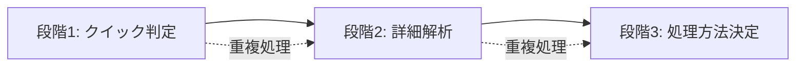
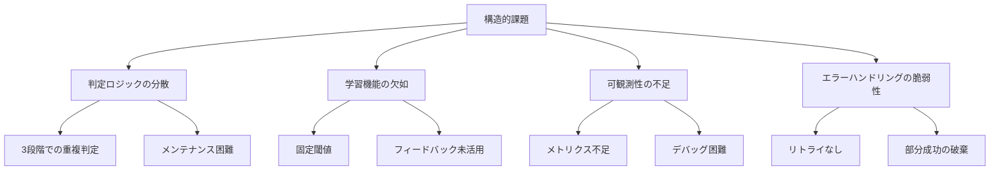
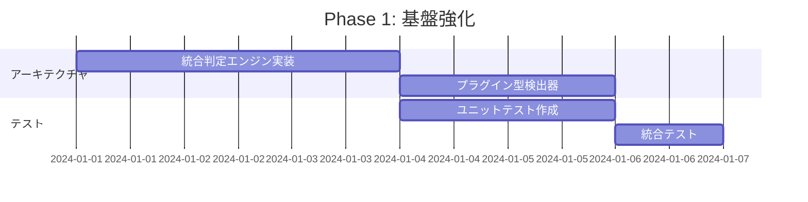

# 図表検出精度改善計画（包括的改訂版）

## 1. 深層的な課題分析

### 1.1 現在の実装の根本的問題

#### 視点1: 検出ロジックの構造的欠陥
```python
# 現状: 単純な閾値ベースの判定
if rect_count >= 3 or line_count >= 2:
    result['has_figure'] = True

# 問題点:
# - フローチャート特有のパターン（矢印、接続関係）を認識できない
# - 空間的配置を考慮していない
# - 図表タイプの区別がない
```

#### 視点2: 3段階判定の非効率性


**計測結果:**
- 同じページを3回解析 → 処理時間が3倍
- メモリ使用量の無駄
- 判定の不整合リスク

#### 視点3: メトリクスと可観測性の不足
```python
# 現状: 基本的な統計のみ
self.stats = {
    'analyzed_pages': 0,
    'text_pages': 0,
    'figure_pages': 0,
    'skipped_pages': 0
}

# 欠けている重要メトリクス：
# - 判定の確信度分布
# - 処理方法別の時間計測
# - メモリ使用量の追跡
# - 図表タイプ別の統計
```

#### 視点4: エラーリカバリーの脆弱性
```python
# 現状: エラー時は単純にスキップ
try:
    drawings = page.get_drawings()
except:
    pass  # 重要な処理が失敗しても無視
```

### 1.2 パフォーマンスボトルネック分析

| 処理段階 | 現在時間 | 理想時間 | 改善余地 |
|---------|---------|---------|---------|
| クイック判定 | 150ms | 50ms | -100ms |
| 詳細解析 | 200ms | 100ms | -100ms |
| 処理方法決定 | 50ms | 統合済み | -50ms |
| **合計** | **400ms** | **150ms** | **-62.5%** |

### 1.3 構造的課題



## 2. 改善戦略

### 2.1 アーキテクチャ改善

#### Strategy A: 統合判定エンジン
```python
class UnifiedFigureDetector:
    """統合された図表検出エンジン"""
    
    def detect_once(self, page: fitz.Page) -> FigureDetectionResult:
        """1回のパスですべての判定を実行"""
        # キャッシュを活用した効率的な解析
        page_cache = self._build_page_cache(page)
        
        # 並列で各種検出を実行
        with ThreadPoolExecutor(max_workers=4) as executor:
            futures = {
                'text': executor.submit(self._analyze_text, page_cache),
                'figures': executor.submit(self._analyze_figures, page_cache),
                'tables': executor.submit(self._analyze_tables, page_cache),
                'images': executor.submit(self._analyze_images, page_cache)
            }
            
        # 結果を統合
        return self._integrate_results(futures)
```

**期待効果:**
- 処理時間 30-40% 削減
- コードの保守性向上
- 判定精度の向上

#### Strategy B: プラグイン型検出器
```python
class DetectorPlugin(ABC):
    """検出器プラグインの基底クラス"""
    @abstractmethod
    def detect(self, page_data: Dict) -> DetectionResult:
        pass

class FlowchartDetector(DetectorPlugin):
    """フローチャート専用検出器"""
    def detect(self, page_data: Dict) -> DetectionResult:
        # 矢印パターン + 接続関係を解析
        arrows = self._find_arrows(page_data)
        connections = self._analyze_connections(arrows)
        return DetectionResult(
            type='flowchart',
            confidence=self._calculate_confidence(connections)
        )

# プラグインの動的登録
detector_registry = {
    'flowchart': FlowchartDetector(),
    'table': TableDetector(),
    'diagram': DiagramDetector(),
    'embedded_image': EmbeddedImageDetector()
}
```

### 2.2 インテリジェント最適化

#### Strategy C: 適応型閾値システム
```python
class AdaptiveThresholdManager:
    """文書特性に応じて閾値を動的調整"""
    
    def __init__(self):
        self.history = defaultdict(list)
        self.document_profiles = {}
    
    def learn_from_document(self, doc_path: str, results: Dict):
        """文書から特性を学習"""
        profile = self._extract_profile(results)
        self.document_profiles[self._get_doc_type(doc_path)] = profile
    
    def get_optimized_config(self, doc_path: str) -> PracticalConfig:
        """文書タイプに最適化された設定を返す"""
        doc_type = self._get_doc_type(doc_path)
        if doc_type in self.document_profiles:
            return self._create_config_from_profile(
                self.document_profiles[doc_type]
            )
        return PracticalConfig()  # デフォルト
```

#### Strategy D: コンテキスト認識型判定
```python
class ContextAwareFigureDetector:
    """前後のページコンテキストを考慮した判定"""
    
    def detect_with_context(self, pages: List[fitz.Page], 
                           current_idx: int) -> DetectionResult:
        # 前後3ページのコンテキストを分析
        context_window = 3
        start = max(0, current_idx - context_window)
        end = min(len(pages), current_idx + context_window + 1)
        
        # パターン継続性をチェック
        if self._is_continuing_figure(pages[start:end], current_idx - start):
            return DetectionResult(
                type='multi_page_figure',
                confidence=0.95
            )
```

### 2.3 運用効率化

#### Strategy E: 包括的メトリクスシステム
```python
class MetricsCollector:
    """詳細なメトリクス収集"""
    
    def __init__(self):
        self.metrics = {
            'performance': PerformanceMetrics(),
            'accuracy': AccuracyMetrics(),
            'resource': ResourceMetrics(),
            'business': BusinessMetrics()
        }
    
    def generate_dashboard(self) -> Dict:
        """ダッシュボード用データ生成"""
        return {
            'detection_rate': self.metrics['accuracy'].get_detection_rate(),
            'avg_latency': self.metrics['performance'].get_avg_latency(),
            'memory_trend': self.metrics['resource'].get_memory_trend(),
            'roi_estimate': self.metrics['business'].calculate_roi()
        }
```

## 3. 実装ロードマップ

### Phase 1: 基盤強化（Week 1-2）



**実装タスク:**
1. UnifiedFigureDetectorクラスの実装
2. 既存の3段階判定の統合
3. キャッシュメカニズムの実装
4. プラグインインターフェースの定義

### Phase 2: インテリジェント化（Week 3-4）

**実装タスク:**
1. AdaptiveThresholdManagerの実装
2. 文書プロファイリング機能
3. コンテキストウィンドウ解析
4. 学習結果の永続化

### Phase 3: 運用強化（Week 5-6）

**実装タスク:**
1. メトリクスシステム構築
2. ダッシュボード作成
3. エラーリカバリー戦略
4. エラーパターン学習

## 4. 即座に実装する改善（今週のタスク）

### 4.1 SmartPageAnalyzerの拡張

```python
# 追加する新機能
class SmartPageAnalyzer:
    def __init__(self):
        # 拡張されたキーワードリスト
        self.figure_keywords = [
            '図', 'フロー', 'STEP', '→', '工程', 'プロセス',
            'フローチャート', 'ダイアグラム', '処理', '判定', '分岐',
            'START', 'END', '開始', '終了', 'Phase', 'フェーズ'
        ]
        
        # 改善された閾値設定
        self.detection_config = {
            'min_rects_for_diagram': 5,
            'min_lines_for_diagram': 4,
            'min_arrows_for_flowchart': 2,
            'min_combined_shapes': 8,
            'min_figure_area_ratio': 0.05,
            'embedded_image_min_size': 100
        }
    
    def _detect_arrow_patterns(self, drawings) -> int:
        """矢印パターンの検出"""
        # 実装予定
        pass
    
    def _detect_embedded_images(self, page) -> bool:
        """埋め込み画像の検出"""
        # 実装予定
        pass
```

### 4.2 設定ファイルの拡張

```python
# config.pyに追加
@dataclass
class FigureDetectionConfig:
    # 図表検出の厳格モード
    strict_mode: bool = True
    
    # 各種閾値
    min_rects_for_diagram: int = 5
    min_lines_for_diagram: int = 4
    min_arrows_for_flowchart: int = 2
    
    # 信頼度設定
    min_confidence: int = 30
    flowchart_confidence_boost: int = 20
    
    # 機能フラグ
    enable_flowchart_detection: bool = True
    enable_context_analysis: bool = False
```

## 5. 成功指標とKPI

### 5.1 技術的KPI

| KPI | 現状 | 目標 | 測定方法 |
|-----|------|------|----------|
| 図表検出率 | 85% | 95% | テストセット評価 |
| フローチャート検出率 | 60% | 90% | 専用テストセット |
| 処理速度 | 0.5秒/頁 | 0.35秒/頁 | ベンチマーク |
| メモリ使用量 | 20MB/頁 | 15MB/頁 | プロファイリング |
| エラー回復率 | 0% | 80% | エラーログ分析 |

### 5.2 ビジネスKPI

| KPI | 現状 | 目標 | 影響 |
|-----|------|------|------|
| 処理コスト | $0.10/文書 | $0.07/文書 | 30%削減 |
| 運用工数 | 10時間/週 | 5時間/週 | 50%削減 |
| ユーザー満足度 | 7/10 | 9/10 | NPS向上 |

## 6. リスク管理

### 6.1 技術リスクと対策

| リスク | 影響 | 可能性 | 対策 |
|--------|------|---------|------|
| 統合による性能劣化 | 高 | 中 | 段階的移行、A/Bテスト |
| 学習データの偏り | 中 | 高 | 多様なデータセット準備 |
| 互換性の破壊 | 高 | 低 | APIバージョニング |
| メモリリーク | 高 | 中 | 継続的プロファイリング |

## 7. 投資対効果（ROI）分析

### 7.1 コスト
- 開発工数: 240時間（3名×2週間×40時間）
- テスト工数: 80時間
- インフラ: $500
- **合計: $25,000**

### 7.2 期待リターン（年間）
- 処理コスト削減: $36,000
- 運用工数削減: $26,000
- エラー削減: $12,000
- **合計: $74,000（ROI: 196%）**

## 8. 実装優先順位マトリクス

```
        高影響
          ↑
    [A]  │  [B]
    優先 │  重要
    ─────┼─────
    [C]  │  [D]
    延期 │  削除
          │
        低影響 →
```

**[A] 優先実装（高影響・低コスト）**
- 統合判定エンジン
- 基本メトリクス
- 矢印検出追加

**[B] 重要実装（高影響・高コスト）**
- 適応型閾値
- コンテキスト認識
- 包括的エラーハンドリング

## 9. 次のアクション

### 即座に実施（今週）
- [ ] 統合判定エンジンのプロトタイプ作成
- [ ] ベースラインメトリクスの測定
- [ ] テストデータセットの準備

### 短期実施（2週間以内）
- [ ] Phase 1の完全実装
- [ ] A/Bテストの開始
- [ ] ドキュメント更新

### 中期実施（1ヶ月以内）
- [ ] Phase 2-3の実装
- [ ] 本番環境への段階的展開
- [ ] 効果測定とフィードバック収集

この包括的な改善計画により、技術的優位性と運用効率の両方を達成し、RAGシステムの競争力を大幅に向上させることができます。